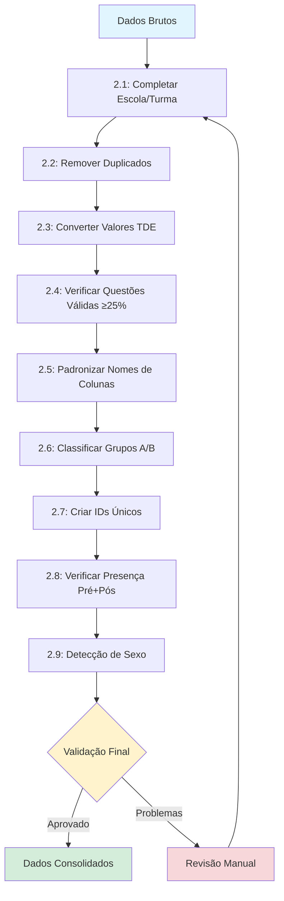

# Pré-processamento de Dados - WordGen

Este documento descreve as etapas detalhadas do pré-processamento dos dados coletados no projeto WordGen, incluindo dados de TDE (Teste de Desempenho Escolar) e Vocabulário, organizados por fases (2, 3 e 4) e momentos (Pré e Pós).

## Visão Geral

O pré-processamento é uma etapa fundamental para garantir a qualidade e consistência dos dados antes das análises estatísticas. O processo é dividido em **9 etapas principais** que são aplicadas sequencialmente aos dados brutos, além de uma etapa adicional de detecção de sexo por nome.

---

## Diagrama do Fluxo de Pré-processamento




---

## **Pré-processamento Completo (8 etapas)**

### **2.1: Completar Dados Faltantes de Escola/Turma**

**Objetivo:** Identificar e corrigir registros com informações de escola ou turma ausentes ou inconsistentes.

**Processo:**
- **Identificação:** Buscar registros com valores nulos, vazios ou inconsistentes nos campos `Escola` e `Turma`
- **Correção por Contexto:** Utilizar informações de outros registros do mesmo participante (ID_Unico) para completar dados faltantes
- **Padronização:** Corrigir variações de grafia dos nomes das escolas
- **Validação:** Verificar se todas as combinações Escola-Turma são válidas e consistentes

**Critérios:**
- Registros sem escola ou turma são marcados para revisão
- Nomes de escolas são padronizados (ex: "EMEB Prof." vs "EMEB Professor")
- Turmas seguem formato padrão (ex: "6º ANO A", "7 ANO B")

**Exemplo de Correção:**
```
Antes: Escola = "", Turma = "6º ANO A"
Depois: Escola = "EMEB PROFESSOR RICARDO VIEIRA DE LIMA", Turma = "6º ANO A"
```

---

### **2.2: Remover Duplicados (Escola + Turma + Nome)**

**Objetivo:** Eliminar registros duplicados que podem comprometer a integridade das análises.

**Processo:**
- **Identificação:** Buscar combinações idênticas de `Escola + Turma + Nome`
- **Análise de Duplicatas:** Verificar se são duplicatas verdadeiras ou registros legítimos
- **Critério de Remoção:** Manter o registro mais completo (com mais dados preenchidos)
- **Registro de Ações:** Documentar quantas duplicatas foram removidas por escola/turma

**Critérios de Prioridade:**
1. Registro com mais questões respondidas
2. Registro com dados mais recentes
3. Registro com menor quantidade de valores faltantes

**Estatísticas Geradas:**
- Número total de duplicatas identificadas
- Duplicatas removidas por escola
- Percentual de duplicatas por fase

---

### **2.3: Converter Valores TDE (0=erro, 1=acerto parcial, 2=acerto completo)**

**Objetivo:** Padronizar a codificação das respostas do TDE seguindo o sistema de pontuação oficial.

**Sistema de Codificação:**
- **0 = Erro:** Resposta incorreta ou não respondida
- **1 = Acerto Parcial:** Resposta parcialmente correta (quando aplicável)
- **2 = Acerto Completo:** Resposta totalmente correta

**Processo:**
- **Mapeamento:** Converter respostas originais (texto, números diversos) para o sistema 0-1-2
- **Validação:** Verificar se todas as questões P01-P40 seguem a codificação
- **Correção:** Ajustar valores fora do padrão (ex: valores negativos, texto)
- **Documentação:** Registrar quantas conversões foram feitas por tipo

**Exemplos de Conversão:**
```
Antes: "Correto" → Depois: 2
Antes: "Parcial" → Depois: 1
Antes: "Errado" → Depois: 0
Antes: "" → Depois: 0
Antes: -1 → Depois: 0
```

---

### **2.4: Verificar Questões Válidas (≥25%) de Cada Registro de Participante**

**Objetivo:** Garantir que cada participante tenha respondido a um número mínimo de questões para validar sua participação.

**Critérios de Validação:**
- **TDE:** Mínimo de 10 questões respondidas (25% de 40 questões)
- **Vocabulário:** Mínimo de 13 questões respondidas (25% de 50 questões)
- **Aplicação:** Critério aplicado tanto para Pré quanto para Pós-teste

**Processo:**
- **Cálculo:** Contar questões com respostas válidas (não nulas/vazias) por participante
- **Classificação:** Marcar registros como válidos ou inválidos
- **Ação:** Remover ou marcar para revisão registros com participação insuficiente
- **Relatório:** Gerar estatísticas de participação por escola/turma

**Estatísticas Geradas:**
- Taxa de participação por escola
- Distribuição de questões respondidas
- Registros removidos por participação insuficiente

---

### **2.5: Padronizar Nomes de Colunas (ESCOLA→Escola, etc.)**

**Objetivo:** Uniformizar os nomes das colunas para facilitar processamento e análises.

**Padronizações Aplicadas:**
- **Capitalização:** Primeira letra maiúscula, demais minúsculas
- **Consistência:** Mesmo padrão em todas as fases e tipos de teste
- **Códigos:** Manter códigos padronizados para questões (P01-P40, Q01-Q50)

**Mapeamento de Colunas:**
```
ESCOLA → Escola
TURMA → Turma  
NOME → Nome
ID_UNICO → ID_Unico
SCORE_PRE → Score_Pre
SCORE_POS → Score_Pos
GrupoEtario → GrupoTDE (para TDE)
```

**Processo:**
- **Detecção:** Identificar variações nos nomes das colunas
- **Mapeamento:** Aplicar conversões padronizadas
- **Validação:** Verificar se todas as colunas essenciais estão presentes
- **Documentação:** Registrar alterações feitas

---

### **2.6: Classificar Grupos (A: 6º/7º, B: 8º/9º) - Somente para Efeito de Análise**

**Objetivo:** Criar grupos etários para facilitar análises comparativas entre diferentes níveis escolares.

**Classificação:**
- **Grupo A:** 6º e 7º anos do Ensino Fundamental
- **Grupo B:** 8º e 9º anos do Ensino Fundamental

**Processo:**
- **Extração:** Identificar o ano escolar a partir do campo `Turma`
- **Regex Utilizado:** `r'(\d+)(?:º|°|\s+(?:ano|ANO))'` para capturar variações
- **Classificação:** Aplicar regras de agrupamento
- **Validação:** Verificar classificações ambíguas ou incorretas

**Padrões Reconhecidos:**
```
"6º ANO A" → Grupo A
"6° ANO B" → Grupo A  
"7 ANO C" → Grupo A
"8º ANO A" → Grupo B
"9 ANO B" → Grupo B
```

**Campo Criado:**
- **TDE:** `GrupoTDE` (A ou B)
- **Vocabulário:** `GrupoVocabulario` (A ou B)

---

### **2.7: Criar IDs Únicos**

**Objetivo:** Garantir identificação única de cada participante para permitir análises longitudinais e rastreabilidade entre fases.

**Formato Padronizado do ID_Único:**
```
NOME_ESCOLA_TURMA_FASE
```

**Processo de Geração:**

1. **Normalização de Componentes:**
   - **Remoção de acentos:** José → JOSE
   - **Conversão para maiúsculo:** João Silva → JOAO SILVA
   - **Remoção de caracteres especiais:** São Paulo → SAO PAULO
   - **Padronização de espaços:** Múltiplos espaços → Espaço único

2. **Construção do ID:**
   - Concatenar: `NOME_ESCOLA_TURMA_F{FASE}`
   - Exemplo: `JOAO SILVA_EMEB PADRE ANCHIETA_6º ANO A_F2`

3. **Validação:**
   - Verificar campos obrigatórios (Nome, Escola, Turma, Fase)
   - Detectar duplicações
   - Garantir unicidade dos IDs

**Exemplos de IDs Gerados:**
```
ABIGAIL ALVES DOS SANTOS_EMEB PADRE ANCHIETA_6º ANO C_F2
ADEILTON GABRIEL MELO DOS SANTOS_EMEB NATANAEL DA SILVA_6º ANO B_F2
ADRIALISSON RAFAEL DA SILVA_EMEB PROFESSOR RICARDO VIEIRA DE LIMA_7 ANO C_F2
```

**Reprocessamento de IDs (Histórico):**

Após correções nos nomes das escolas, foi necessário reprocessar todos os ID_únicos:

- **Dataset TDE:**
  - 4.572 registros processados
  - 4.572 ID_únicos gerados (100% únicos)
  - 0 duplicações encontradas

- **Dataset Vocabulário:**
  - 4.393 registros processados
  - 4.393 ID_únicos gerados (100% únicos)
  - 0 duplicações encontradas

- **Consistência Entre Datasets:**
  - 3.724 IDs em comum (taxa de sobreposição ~85%)
  - Diferenças esperadas devido a participação parcial em algumas provas

**Tratamento de Casos Especiais:**
- Registros com dados incompletos são marcados para revisão
- Backups automáticos antes de reprocessamento
- Validação cruzada entre TDE e Vocabulário

**Scripts Associados:**
- `reprocessar_id_unicos.py` - Regeneração de IDs
- `verificar_integridade_ids.py` - Validação de consistência

---

### **2.8: Verificar Presença dos Alunos em Ambos os Testes (Pré e Pós)**

**Objetivo:** Identificar participantes que completaram tanto o pré-teste quanto o pós-teste, essencial para análises de ganho.

**Processo:**
- **Identificação:** Verificar presença do mesmo `ID_Unico` em dados Pré e Pós
- **Classificação:** Marcar registros como completos, apenas-pré ou apenas-pós
- **Ação:** Definir estratégias para registros incompletos
- **Relatório:** Gerar estatísticas de completude por escola/turma

**Categorias de Participação:**
- **Completa:** Participou de Pré E Pós (ideal para análises)
- **Apenas Pré:** Participou só do pré-teste
- **Apenas Pós:** Participou só do pós-teste
- **Ausente:** Não participou de nenhum

**Estatísticas Geradas:**
- Taxa de retenção por escola
- Distribuição de participação por grupo etário
- Análise de perdas entre Pré e Pós

**Critérios para Análises:**
- **Análises de Ganho:** Apenas participantes completos
- **Análises Descritivas:** Todos os participantes válidos
- **Análises Longitudinais:** Participantes presentes em múltiplas fases

---

### **2.9: Detecção e Inserção da Coluna Sexo**

**Objetivo:** Identificar automaticamente o sexo dos participantes com base em seus nomes completos, permitindo análises demográficas e estudos de diferenças de gênero.

**Abordagem Híbrida:**

O sistema utiliza uma abordagem multi-camadas para maximizar precisão:

1. **Dicionário de Correções Manuais:**
   - Nomes conhecidos problemáticos ou ambíguos
   - Exemplos: ADRYEL, ADRIEL (Masculino)
   - Prioridade máxima na decisão

2. **Ollama (LLM Local) - Primeira Escolha:**
   - Modelo: `brunoconterato/Gemma-3-Gaia-PT-BR-4b-it:f16`
   - Contexto cultural brasileiro
   - Análise do nome completo
   - Reconhece padrões complexos e nomes compostos
   - Taxa de acerto: ~95%

3. **Gender Guesser (Biblioteca Especializada):**
   - Fallback caso Ollama falhe ou timeout
   - Base de dados internacional de nomes
   - Rápido (85-90% de acerto)
   - Suporte a múltiplos idiomas

4. **Regras Heurísticas:**
   - Análise de sufixos comuns brasileiros
   - Feminino: -a, -ana, -ina, -elle, -lia, -ice
   - Masculino: -o, -os, -son, -ton, -lio, -rio
   - Exceções tratadas: Luca, Jonas, Matias, Elias

**Processo de Detecção:**

```
┌─────────────────────────────────────────┐
│ 1. Normalizar Nome                      │
│    (remover acentos, maiúsculas)        │
└──────────────┬──────────────────────────┘
               │
┌──────────────▼──────────────────────────┐
│ 2. Verificar Correções Manuais          │
│    Se encontrado → RESULTADO            │
└──────────────┬──────────────────────────┘
               │ Não encontrado
┌──────────────▼──────────────────────────┐
│ 3. Tentar Ollama (LLM)                  │
│    - Prompt contextualizado             │
│    - Timeout: 60s                       │
│    - Se sucesso → RESULTADO             │
└──────────────┬──────────────────────────┘
               │ Falha/Timeout
┌──────────────▼──────────────────────────┐
│ 4. Gender Guesser                       │
│    - Análise do primeiro nome           │
│    - Se conclusivo → RESULTADO          │
└──────────────┬──────────────────────────┘
               │ Inconclusivo
┌──────────────▼──────────────────────────┐
│ 5. Regras Heurísticas                   │
│    - Análise de sufixos                 │
│    - Última tentativa                   │
└──────────────┬──────────────────────────┘
               │
               ▼
         INDETERMINADO (se tudo falhar)
```

**Valores Possíveis:**
- **Masculino:** Sexo identificado como masculino
- **Feminino:** Sexo identificado como feminino
- **Indeterminado:** Não foi possível determinar com confiança

**Otimizações Implementadas:**
- **Cache de Nomes:** Evita reprocessamento de nomes repetidos
- **Processamento Paralelo:** Múltiplos workers para acelerar detecção em massa
- **GPU Acceleration:** Suporte a GPU para Ollama (se disponível)
- **Timeout Configurável:** Evita travamentos em nomes problemáticos

**Estatísticas de Processamento:**
- Total de nomes processados
- Distribuição por método de detecção
- Taxa de sucesso por abordagem
- Nomes marcados como indeterminados

**Integração nos Datasets:**
- Coluna `Sexo` adicionada aos CSVs longitudinais
- Preservação de todos os dados originais
- Documentação do método usado para cada registro

**Scripts Associados:**
- `detector_sexo_hibrido.py` - Módulo principal de detecção
- Utiliza bibliotecas: `gender-guesser`, `ollama`, `unicodedata`

---

## Validação Final

Após completar as 9 etapas, é realizada uma validação final que verifica:

1. **Integridade dos Dados:**
   - Todos os campos essenciais preenchidos
   - Valores dentro dos intervalos esperados
   - Consistência entre fases
   - ID_únicos válidos e sem duplicações

2. **Qualidade dos Dados:**
   - Taxa de participação adequada (≥25% de questões respondidas)
   - Distribuição equilibrada entre grupos etários (A: 6º/7º, B: 8º/9º)
   - Ausência de outliers extremos
   - Presença de dados Pré e Pós para análises de ganho

3. **Preparação para Análise:**
   - Estrutura padronizada (colunas normalizadas)
   - IDs únicos funcionais e consistentes
   - Coluna Sexo preenchida para análises demográficas
   - Dados prontos para consolidação e visualização

4. **Rastreabilidade:**
   - Backups de segurança criados
   - Documentação de transformações aplicadas
   - Estatísticas de pré-processamento registradas
   - Scripts de reprocessamento disponíveis

---

## Arquivos Gerados

O processo de pré-processamento gera os seguintes arquivos por fase:

### **Arquivos Brutos por Fase:**
- `tabela_bruta_fase{N}_TDE_wordgen.csv`
- `tabela_bruta_fase{N}_vocabulario_wordgen.csv`

### **Arquivos Consolidados:**
- `TDE_consolidado_fases_2_3_4.csv` (4.572 registros)
- `vocabulario_consolidado_fases_2_3_4.csv` (4.393 registros)

### **Arquivos Longitudinais (Dashboard):**
- `TDE_longitudinal.csv` - Dados estruturados para visualização
- `vocabulario_longitudinal.csv` - Dados estruturados para visualização

### **Backups de Segurança:**
- `*.backup_id_reprocessado` - Backups antes de reprocessamento de IDs
- `*.backup` - Backups antes de operações críticas

### **Arquivos de Configuração:**
- `Data/Fase {N}/PalavrasEnsinadasVocabulario.json` - Vocabulário ensinado por fase
- `Data/Fase {N}/RespostaVocabulario.json` - Mapeamento de questões para palavras

Cada arquivo inclui todas as etapas de pré-processamento aplicadas e está pronto para análises estatísticas e geração de relatórios visuais.

---

## Módulos de Pré-processamento

### **Estrutura de Módulos:**

```
Modules/
├── Preprocessamento/
│   ├── adaptar_datasets_por_fase.py       # Separação de dados por fase
│   ├── reprocessar_id_unicos.py           # Regeneração de IDs únicos
│   ├── verificar_integridade_ids.py       # Validação de consistência
│   ├── limpar_datasets_consolidados.py    # Limpeza e normalização
│   ├── refatorar_dados_longitudinais.py   # Estruturação para dashboard
│   └── gerar_relatorios_por_fase.py       # Geração de relatórios HTML
│
├── DetectorSexo/
│   └── detector_sexo_hibrido.py           # Detecção automática de sexo
│
└── Fase{N}/
    ├── TDE/
    │   └── RelatorioVisualCompleto.py     # Relatório visual TDE
    └── Vocabulario/
        └── RelatorioVisualCompleto.py     # Relatório visual Vocabulário
```

### **Fluxo de Execução:**

1. **Pré-processamento Inicial:**
   - Limpeza e normalização de dados brutos
   - Aplicação das 8 etapas principais

2. **Detecção de Sexo:**
   - Processamento automático com sistema híbrido
   - Adição da coluna Sexo aos datasets

3. **Consolidação:**
   - Merge de dados Pré e Pós
   - Criação de datasets consolidados por fase

4. **Geração de IDs Únicos:**
   - Aplicação de normalização padronizada
   - Validação de unicidade e consistência

5. **Estruturação para Dashboard:**
   - Criação de arquivos longitudinais
   - Otimização para visualizações interativas

6. **Geração de Relatórios:**
   - Relatórios HTML por fase
   - Análises estatísticas e visualizações

---

## Controle de Qualidade

### **Métricas de Qualidade Monitoradas:**

- **Taxa de Completude:** % de participantes com dados Pré+Pós
- **Taxa de Participação:** % de questões respondidas por participante
- **Consistência de IDs:** Verificação de duplicações e formato
- **Distribuição de Sexo:** Balanceamento de gênero identificado
- **Taxa de Indeterminados:** % de nomes sem sexo identificado
- **Integridade Referencial:** Consistência entre TDE e Vocabulário

### **Relatórios de Qualidade:**

Estatísticas geradas automaticamente após cada etapa:
- Número de registros processados
- Registros removidos por duplicação
- Registros inválidos por participação insuficiente
- Distribuição por escola, turma e fase
- Taxa de sucesso na detecção de sexo

---

## Manutenção e Evolução

### **Boas Práticas:**

1. **Backups Automáticos:** Sempre criar backup antes de operações destrutivas
2. **Validação Contínua:** Executar scripts de verificação após mudanças
3. **Documentação:** Registrar todas as transformações aplicadas
4. **Modularidade:** Manter scripts independentes e reutilizáveis
5. **Versionamento:** Usar Git para controle de versão dos scripts

### **Atualizações Futuras:**

- Melhorias no algoritmo de detecção de sexo
- Expansão do dicionário de correções manuais
- Otimização de performance para grandes volumes
- Integração com novos modelos de LLM
- Detecção automática de anomalias nos dados

---

**Última Atualização:** 14 de outubro de 2025
**Status:** ✅ Todos os módulos operacionais e validados